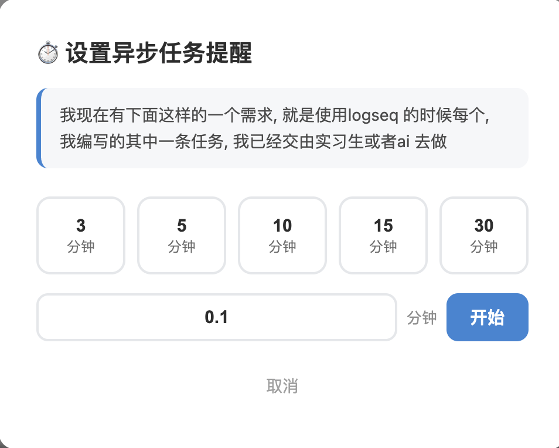
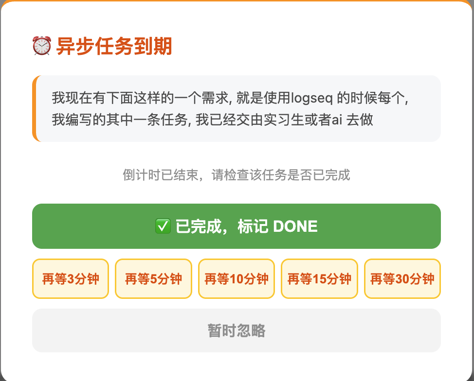
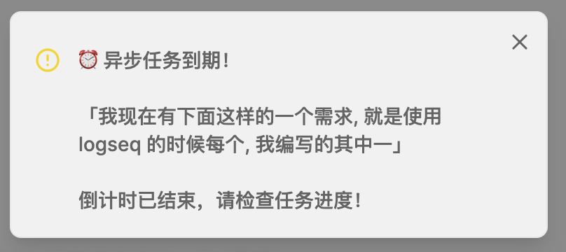
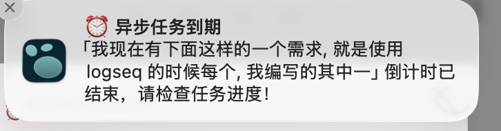

# ⏱️ Logseq Async Task Timer

A Logseq plugin for delegated/async task reminders. Set a countdown timer on any block you've handed off to an AI, intern, or collaborator — get notified when it's time to check back.

[中文说明](#中文说明) | [English](#motivation)

---

## Motivation

When multitasking in Logseq, you often delegate tasks — to an AI assistant, an intern, or a colleague — and then context-switch to your next task. But you need a reliable way to **remember to check back** after a few minutes.

This plugin adds a simple countdown timer to any block. When the timer expires, you get a popup reminder telling you exactly which task to check. You can then:

- **Mark it DONE** if the task is complete
- **Snooze** for another few minutes if it's still in progress
- **Dismiss** the reminder

No more forgetting about delegated tasks. No more constantly checking. Just set a timer and focus on your current work.

## Features

- **Quick presets**: 3, 5, 10, 15, or 30 minute timers with one click
- **Custom duration**: Enter any value (supports decimals, e.g. `0.5` = 30 seconds)
- **Visual marker**: Adds ⏰ to the block so you can see at a glance which tasks are being timed
- **Multi-channel alerts**: In-app popup + system desktop notification + audio alert
- **Expiry dialog**: When time's up, a dialog lets you mark DONE / snooze / dismiss
- **Auto DONE**: "Mark complete" automatically changes TODO/DOING/LATER/NOW → DONE and removes the ⏰ marker
- **Multiple timers**: Run as many concurrent timers as you need
- **Toolbar button**: Click the clock icon to see all active timers

## Screenshots

### Setting a timer



### Timer expired notification







## Usage

### 3 ways to start a timer

1. **Slash command** — Type `/异步任务计时` or `/Async Timer` in any block
2. **Block context menu** — Right-click a block → `⏱️ 设置异步提醒`
3. **Toolbar** — Click the ⏱️ icon in the top toolbar to view active timers

### Workflow

1. Write a task in Logseq (e.g. `TODO Ask AI to refactor the login module`)
2. Delegate it, then trigger the timer on that block
3. Pick a preset (3/5/10/15/30 min) or enter a custom duration
4. The block gets a ⏰ marker, and you continue with other work
5. When the timer expires:
   - A popup dialog appears showing which task is due
   - A desktop notification is sent
   - An alert sound plays
6. Check the task:
   - **Done?** → Click "✅ 已完成" to mark it DONE
   - **Not yet?** → Click a snooze button to wait a few more minutes
   - **Don't care?** → Click "暂时忽略" to dismiss

## Installation

### From Logseq Plugin Marketplace

1. Open Logseq → `Settings` → `Plugins`
2. Search for **Async Task Timer**
3. Click `Install`

### Manual Installation

1. Download the latest release from [GitHub Releases](https://github.com/hzphzp/logseq-async-task-timer/releases)
2. Unzip to `~/.logseq/plugins/logseq-async-task-timer`
3. In Logseq, enable `Developer mode` in settings
4. Go to `Plugins` → `Load unpacked plugin` → select the plugin folder
5. Restart Logseq

### Build from Source

```bash
git clone https://github.com/hzphzp/logseq-async-task-timer.git
cd logseq-async-task-timer
npm install
npm run build
```

Then load the plugin folder in Logseq as described above.

## License

[MIT](./LICENSE)

---

## 中文说明

### 为什么需要这个插件？

在 Logseq 中处理多任务时，你经常会把一些任务**委派出去** —— 交给 AI 助手、实习生、或同事。然后你切换到下一个任务继续工作。

问题是：你需要一种可靠的方式**提醒自己回去检查**委派出去的任务进度。

这个插件就是解决这个问题的：给任意 block 设一个倒计时，到时间了弹窗提醒你去检查。

### 功能特性

- **快捷预设**：一键设置 3 / 5 / 10 / 15 / 30 分钟倒计时
- **自定义时长**：支持小数输入（如 `0.5` = 30 秒，`0.1` = 6 秒）
- **可视标记**：设置计时后自动在 block 后添加 ⏰，一眼就能看到哪些任务在计时
- **多重提醒**：到期后同时触发 应用内弹窗 + 系统桌面通知 + 提示音
- **到期操作**：弹窗中可以选择 标记完成 / 再等几分钟 / 暂时忽略
- **自动标记 DONE**：点击"已完成"会自动将 TODO/DOING/LATER/NOW 改为 DONE，并移除 ⏰
- **多任务并行**：可以同时运行多个计时器
- **工具栏按钮**：点击顶栏闹钟图标查看所有进行中的计时任务

### 使用方法

#### 三种启动方式

1. **斜杠命令** — 在任意 block 中输入 `/异步任务计时` 或 `/Async Timer`
2. **右键菜单** — 右键点击 block → 选择 `⏱️ 设置异步提醒`
3. **工具栏** — 点击顶部工具栏的 ⏱️ 图标查看活跃计时器

#### 典型工作流

1. 在 Logseq 中写一条任务，例如 `TODO 让 AI 重构登录模块`
2. 把任务交给 AI 或实习生后，在这个 block 上触发计时
3. 选择一个预设时间（3/5/10/15/30 分钟）或输入自定义时长
4. Block 后面出现 ⏰ 标记，你继续做自己的其他任务
5. 倒计时结束后：
   - 弹出对话框，显示是哪个任务到期了
   - 系统桌面通知弹出
   - 播放提示音
6. 检查任务进度：
   - **完成了？** → 点击「✅ 已完成，标记 DONE」
   - **还没完成？** → 点击贪睡按钮，再等几分钟
   - **暂时不管？** → 点击「暂时忽略」

### 安装方式

#### 从 Logseq 插件市场安装

1. 打开 Logseq → `设置` → `插件`
2. 搜索 **Async Task Timer**
3. 点击 `安装`

#### 手动安装

1. 从 [GitHub Releases](https://github.com/hzphzp/logseq-async-task-timer/releases) 下载最新版本
2. 解压到 `~/.logseq/plugins/logseq-async-task-timer`
3. 在 Logseq 设置中开启「开发者模式」
4. 进入「插件」页面 → 点击「Load unpacked plugin」→ 选择插件文件夹
5. 重启 Logseq

#### 从源码构建

```bash
git clone https://github.com/hzphzp/logseq-async-task-timer.git
cd logseq-async-task-timer
npm install
npm run build
```

构建完成后按上述手动安装方式加载即可。
