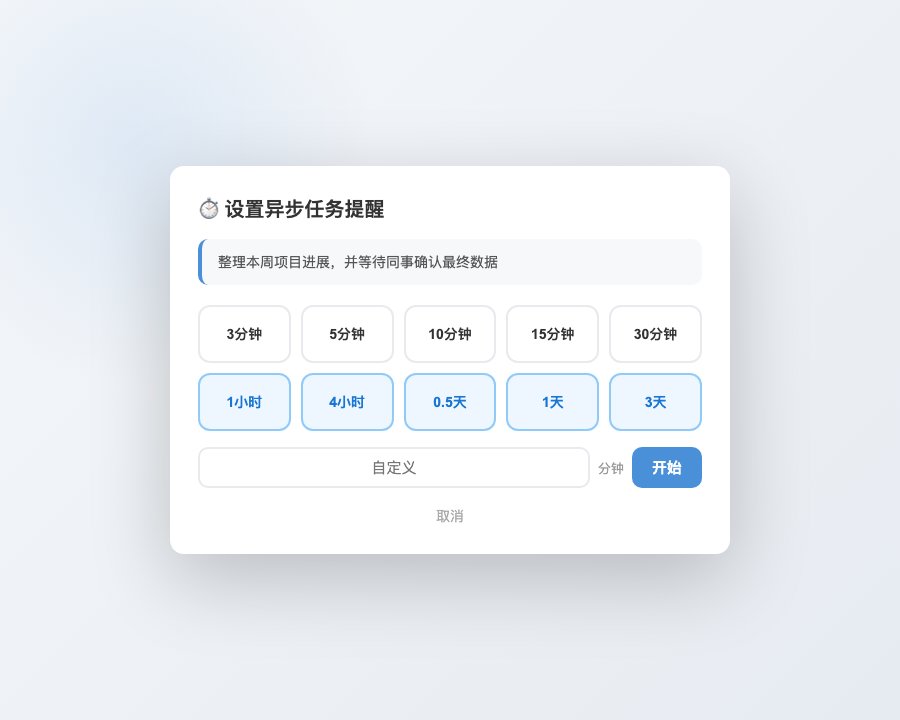
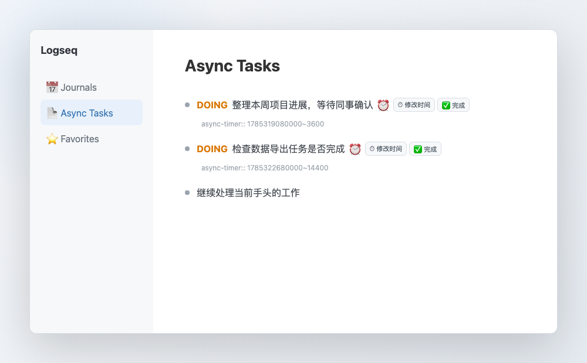
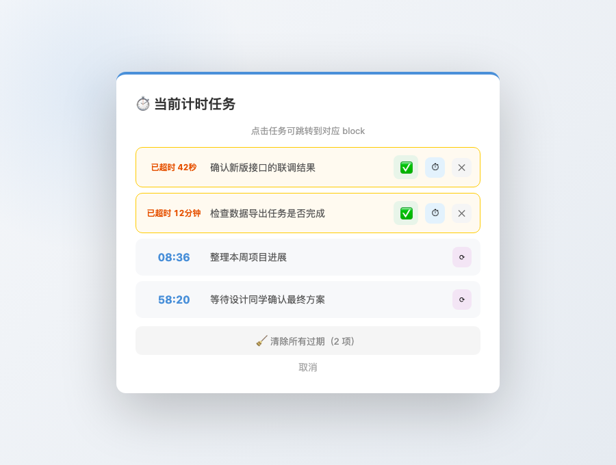
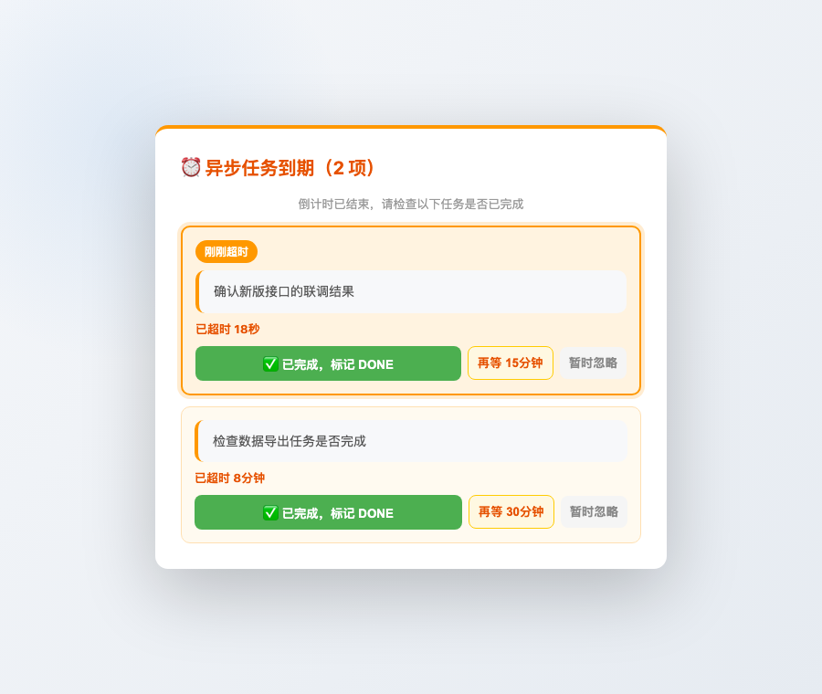
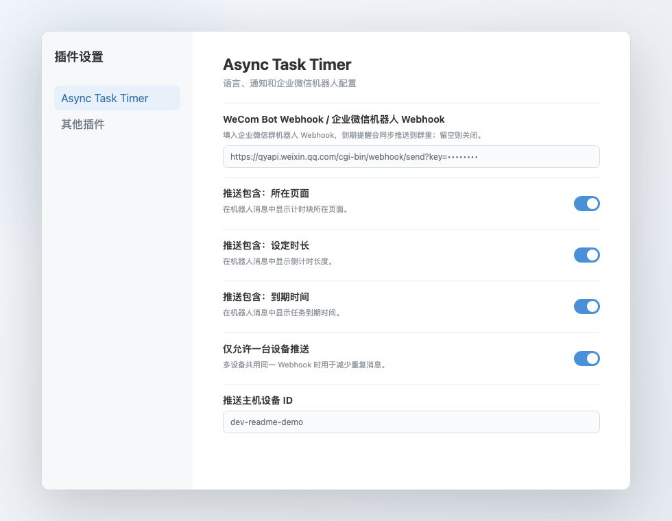

# ⏱️ Logseq Async Task Timer

[](https://github.com/hzphzp/logseq-async-task-timer/releases)
[](./LICENSE)

给委派给 AI、同事、实习生或后台流程的任务设置倒计时。时间到后，插件会提醒你回来检查进度，并允许直接完成、延长或忽略任务。

[中文说明](#中文说明) · [English](#english)

## 中文说明

### 功能概览

- **快捷计时**：预设 `3 / 5 / 10 / 15 / 30 分钟`、`1 小时`、`4 小时`、`0.5 天`、`1 天`、`3 天`，也支持自定义分钟数和小数。
- **自动进入 DOING**：开始计时后，任务第一行会自动标为 `DOING`，并添加 ⏰ 标记。
- **Block 内直接操作**：计时任务旁显示「修改时间」和「完成」按钮，无需先打开工具栏面板。
- **多渠道提醒**：到期时触发 Logseq 消息、系统桌面通知、提示音，以及可选的企业微信群机器人通知。
- **清晰的到期弹窗**：刚刚到期的任务会橙色高亮；每项任务显示已超时时长，标题可点击跳转到原 block。
- **集中任务面板**：工具栏时钟按钮列出全部计时任务。到期任务优先，并按超时时长从短到长排列；未到期任务按到期时间排列。
- **完整的任务操作**：可完成、重新计时、自定义延长、忽略单项任务，或一次清除全部过期任务。
- **持久化与同步**：计时数据写入任务 block，重启 Logseq 后自动恢复，也可随图谱内容同步到其他设备。
- **中英文界面**：支持自动检测、英文和中文。

### 截图

以下界面基于 `v1.6.7`。

<table>
  <tr>
    <td width="50%"><strong>设置倒计时</strong><br></td>
    <td width="50%"><strong>Block 内修改或完成</strong><br></td>
  </tr>
  <tr>
    <td><strong>计时任务面板</strong><br></td>
    <td><strong>到期任务高亮与操作</strong><br></td>
  </tr>
  <tr>
    <td><strong>企业微信机器人设置</strong><br></td>
    <td></td>
  </tr>
</table>

### 快速开始

#### 1. 创建计时任务

在目标 block 中使用以下任一方式：

1. 输入 `/Async Timer` 或 `/异步任务计时`。
2. 右键点击 block，选择「⏱️ 设置异步提醒」。
3. 已有计时任务可直接点击 block 后面的「⏱ 修改时间」。

选择预设时间，或输入自定义分钟数。例如：

- `0.5` = 30 秒
- `90` = 1.5 小时
- `1440` = 1 天

开始后，普通 block 或已有任务状态都会被转换为 `DOING`：

```markdown
DOING 等待 AI 完成接口重构 ⏰ {{renderer :async-task-timer-controls}}
async-timer:: 1785319080000~3600
```

`async-timer::` 是插件的计时元数据，请不要在计时期间手动修改。

#### 2. 查看和管理任务

点击 Logseq 顶部工具栏的时钟图标：

- **已过期任务**排在前面，并按超时时长从短到长排序。
- **进行中的任务**按最早到期优先排序。
- 点击任务标题可跳转到对应 block。
- 已过期任务支持：✅ 完成、⏱ 延长、✕ 忽略。
- 进行中的任务可点击 ⟳ 重新设置时间。

#### 3. 处理到期提醒

任务到期后会显示操作弹窗：

- **完成**：清除计时元数据、⏰ 和内联按钮；`TODO`/`DOING` 会变为 `DONE`。
- **再等一段时间**：使用预设或自定义分钟数重新开始计时。
- **暂时忽略**：只移除计时器和 ⏰，不主动修改任务状态。
- **点击任务标题**：关闭弹窗并跳转到任务所在 block。

当多个任务已经到期时，弹窗会：

- 高亮本次刚刚到期的任务。
- 显示每个任务已超时多久。
- 按超时时长从短到长排列。
- 保留全部任务，处理一项不会丢失其他提醒。

### 企业微信机器人通知

#### 1. 在企业微信创建消息推送

1. 在企业微信中拉一个群聊；也可以先拉一个机器人组成测试群。
2. 在企业微信桌面端右键点击该群聊。
3. 进入 `管理聊天信息 → 消息推送 → 自定义消息推送`。
4. 新建一个自定义消息推送，例如命名为「Async Task Timer」。
5. 创建完成后复制系统生成的 Webhook URL，格式通常类似：

   ```text
   https://qyapi.weixin.qq.com/cgi-bin/webhook/send?key=xxxxxxxx-xxxx-xxxx-xxxx-xxxxxxxxxxxx
   ```

Webhook URL 相当于该群消息推送的密钥。不要把真实地址提交到 Git、README、截图或发送给无关人员。

#### 2. 在插件中填写 Webhook

1. 进入 `Logseq → 插件 → Async Task Timer → 设置`。
2. 将刚才复制的完整 URL 粘贴到 `WeCom Bot Webhook / 企业微信机器人 Webhook`。
3. 按需开启或关闭「所在页面」「设定时长」「到期时间」。
4. 建议先创建一个 `0.1` 分钟的测试计时，约 6 秒后检查群聊是否收到消息。

配置成功后，到期消息可包含：

- 任务标题
- 所在页面
- 原始计时时长
- 到期时间
- 当前超时状态

Logseq 重启时，如果同时发现多个已过期任务，插件会尝试合并为一条摘要消息，避免连续刷屏。

#### 多设备建议

插件设置默认是每台设备本地保存的。多台设备共用同一个 Webhook 时，最稳妥的配置是：

1. 只在一台长期在线的设备上填写 Webhook；其他设备留空。
2. 或在主设备开启「仅允许一台设备推送」，等待生成主机 ID。
3. 将该主机 ID 手动复制到其他设备的对应设置，并同样开启该选项。

企业微信是附加通知渠道；本地弹窗、系统通知和任务面板仍是主要提醒方式。

### 设置项

| 设置 | 说明 | 默认值 |
| --- | --- | --- |
| Language / 界面语言 | `auto`、`en` 或 `zh` | `auto` |
| WeCom Bot Webhook | 企业微信群机器人 Webhook；留空关闭 | 空 |
| 推送包含：所在页面 | 企业微信消息中显示页面名 | 开启 |
| 推送包含：设定时长 | 企业微信消息中显示原始倒计时 | 开启 |
| 推送包含：到期时间 | 企业微信消息中显示到期时间 | 开启 |
| 仅允许一台设备推送 | 使用主机 ID 降低多设备重复推送 | 关闭 |
| 推送主机设备 ID | 指定允许推送的设备 | 空 |

### 提醒与任务状态说明

- 首次使用系统桌面通知时，请允许 Logseq 发送通知。
- 新建计时会把 `TODO`、`DONE`、`LATER`、`NOW`、`WAITING` 等状态转换为 `DOING`；无任务状态的 block 会添加 `DOING`。
- 点击「完成」时，只有当前为 `TODO` 或 `DOING` 的任务会改成 `DONE`；其他状态只清理计时内容。
- 点击「暂时忽略」不会标记 `DONE`。
- 手动删除 `async-timer::` 行相当于删除计时数据，其他设备同步后也会停止该计时。

### 安装与更新

#### Logseq 插件市场

1. 打开 `Logseq → 设置 → 插件`。
2. 搜索 **Async Task Timer**。
3. 点击安装；已有版本可在插件页面执行更新。

#### 手动安装

1. 从 [GitHub Releases](https://github.com/hzphzp/logseq-async-task-timer/releases) 下载最新版本。
2. 解压到 `~/.logseq/plugins/logseq-async-task-timer`。
3. 在 Logseq 设置中启用开发者模式。
4. 选择 `插件 → Load unpacked plugin` 并打开插件目录。
5. 更新文件后，重载插件或重启 Logseq。

#### 从源码构建

```bash
git clone https://github.com/hzphzp/logseq-async-task-timer.git
cd logseq-async-task-timer
npm install
npm run build
```

插件入口为 `dist/index.html`。

### 常见问题

**没有系统桌面通知**

检查 macOS/Windows 的系统通知权限，确认 Logseq 被允许发送通知。插件内弹窗和任务面板不依赖系统通知权限。

**企业微信群出现重复消息**

确认只有一台设备配置 Webhook，或按上面的多设备步骤手动统一主机 ID。

**Block 后没有「修改时间 / 完成」按钮**

先确认该 block 仍包含 `async-timer::` 行，然后重载插件。按钮由 block 中的 renderer 宏生成。

**工具栏面板中没有任务**

确认计时属性没有被手动删除。重载插件后，插件会重新扫描图谱中的计时 block。

---

## English

Async Task Timer adds persistent countdown reminders to Logseq blocks delegated to an AI, colleague, intern, or background process.

### Features

- Presets for 3, 5, 10, 15, and 30 minutes; 1 and 4 hours; 0.5, 1, and 3 days.
- Decimal custom durations in minutes.
- Automatically marks a timed block as `DOING` and adds a ⏰ marker.
- Inline **Change time** and **Complete** controls.
- In-app popup, desktop notification, sound, and optional WeCom bot notification.
- Newly expired task highlighting and visible overdue durations.
- Clickable task titles that jump back to the source block.
- Toolbar panel with expired tasks first, ordered from shortest to longest overdue.
- Complete, snooze, reset, dismiss, and clear-all actions.
- Block-based persistence that survives restarts and can follow graph synchronization.
- English and Chinese UI.

### Screenshots

<table>
  <tr>
    <td width="50%"><strong>Timer picker</strong><br></td>
    <td width="50%"><strong>Inline controls</strong><br></td>
  </tr>
  <tr>
    <td><strong>Timer panel</strong><br></td>
    <td><strong>Expired task dialog</strong><br></td>
  </tr>
</table>

### Usage

1. Open a block and run `/Async Timer` or `/异步任务计时`, or use the block context menu.
2. Pick a preset or enter a custom number of minutes.
3. The block becomes `DOING` and receives a timer marker plus inline controls.
4. Use the toolbar clock to view all timers or jump to their blocks.
5. When a timer expires, complete it, snooze it, or dismiss it.

Completing removes all timer metadata and changes `TODO`/`DOING` to `DONE`. Dismissing only removes the timer and clock marker.

### WeCom notifications

To configure WeCom:

1. Create or open a group chat in the WeCom desktop app.
2. Right-click the chat and open `Manage chat information → Message push → Custom message push`.
3. Create a custom message push and copy its generated webhook URL.
4. Open `Logseq → Plugins → Async Task Timer → Settings` and paste the full URL into **WeCom Bot Webhook**.
5. Create a `0.1` minute test timer and verify that the group receives a message after about six seconds.

Treat the webhook URL as a secret. Page name, duration, and due time can be enabled independently. For multiple devices, the safest setup is to configure the webhook on only one device because Logseq plugin settings are local to each installation.

### Installation

Install **Async Task Timer** from the Logseq Plugin Marketplace, or download the latest [GitHub Release](https://github.com/hzphzp/logseq-async-task-timer/releases) and load the unpacked plugin directory in developer mode.

To build from source:

```bash
npm install
npm run build
```

## License

[MIT](./LICENSE)
